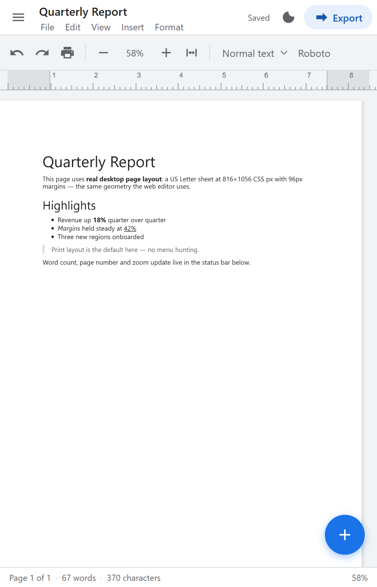
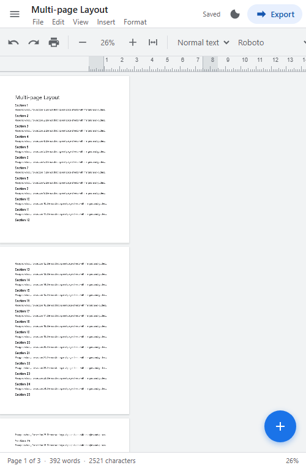
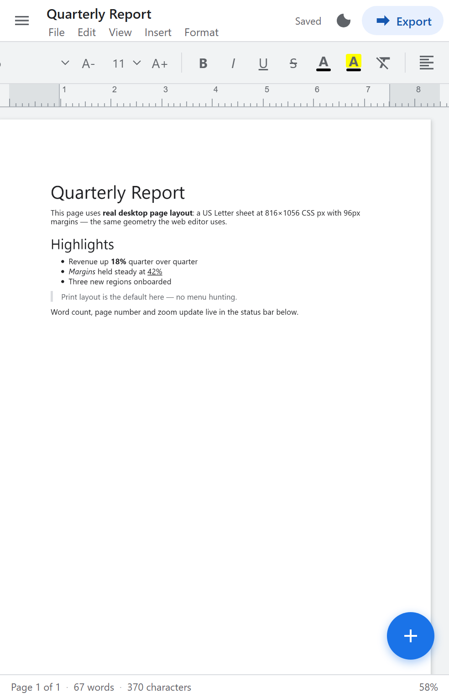
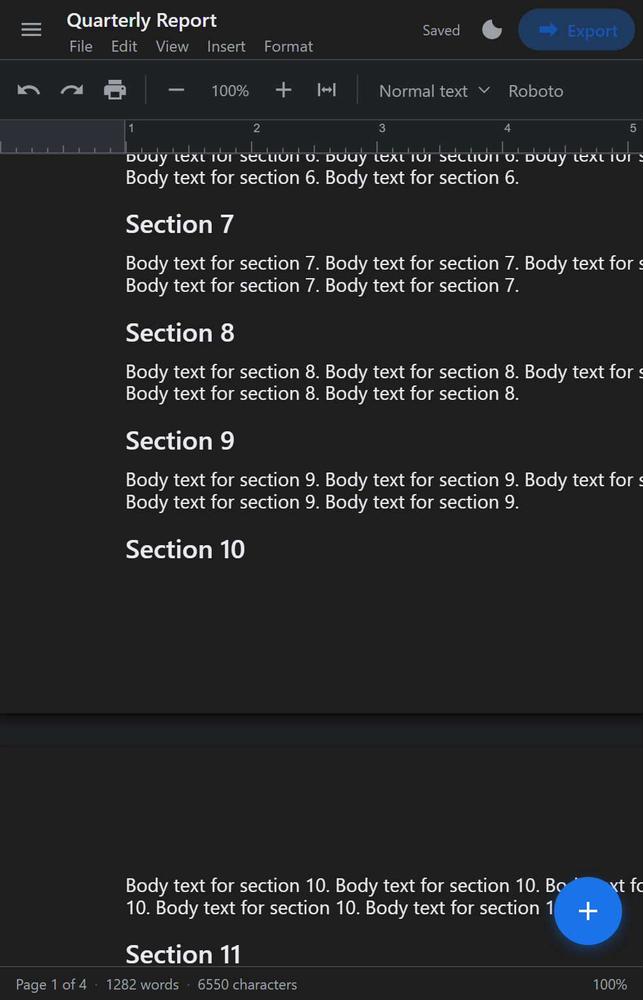

# Docs — a desktop-class document editor for Android

A Google-Docs-style rich text editor that runs **the desktop page experience on a phone**:
real 8.5″ × 11″ page sheets, margins, a ruler, and a full always-visible formatting
toolbar — no hunting through a mobile menu to find "Print layout".

## What it is

| | |
|---|---|
| **APK** | [`apk/Docs-debug.apk`](apk/Docs-debug.apk) (181 KB, debug-signed) |
| **Package** | `com.docsclone.app` |
| **Min / target SDK** | 24 (Android 7.0) / 34 (Android 14) |
| **Architecture** | Native Android shell (`WebView`) + self-contained HTML/CSS/JS editor engine |
| **Dependencies** | None (pure framework Android; editor engine is dependency-free) |

## Screenshots

| Document (fit to width) | Multi-page with gutters |
|---|---|
|  |  |

| Formatting toolbar | Dark theme |
|---|---|
|  |  |

## Project status

_Last verified: 2026-09-27_

| Item | Value |
|---|---|
| APK | [`apk/Docs-debug.apk`](apk/Docs-debug.apk) — 180,942 bytes |
| APK MD5 | `b1797c71e3fe4b249c68a3e38985adb6` |
| Signature | APK Signature Scheme v2 (debug key) |
| Automated checks | 92 passing (19 engine, 44 export/import, 11 live geometry) + 18 on-device |

## Environment snapshot

_Versions confirmed on 2026-09-27._

| Component | Version | Source |
|---|---|---|
| Android compile / target SDK | 34 (Android 14) | `app/build.gradle` |
| Android min SDK | 24 (Android 7.0) | `app/build.gradle` |
| Android Gradle Plugin | 8.4.2 | `build.gradle` |
| Gradle | 8.7 | `gradle/wrapper/gradle-wrapper.properties` |
| JDK | 17 (Temurin 17.0.20.1) | build environment |
| Build tools | 34.0.0 | build environment |

### Upgrade available

Verified against upstream sources on 2026-09-27:

- **Android Gradle Plugin** — 9.4.0 is current stable; this repo uses 8.4.2
  ([release notes](https://developer.android.com/build/releases/agp-9-4-0-release-notes)).
  AGP 9.4 requires Gradle 9.6.0+, JDK 17, and build-tools 36.0.0.
- **Gradle** — 9.8.0 released 2026-09-24; this repo uses 8.7
  ([release notes](https://docs.gradle.org/9.8.0/release-notes.html)). 9.7.1 is also available.
- **compileSdk** — Android 16 (API 36) is stable; this repo compiles against 34.

None of these are blocking — the project builds and runs fine as-is. Upgrading is a
deliberate maintenance task, not an automatic change: AGP 9.x needs a Gradle and
build-tools bump together, so it should be done in one reviewed commit with a full
rebuild and re-test.

> Both tables above are refreshed automatically each day by a scheduled job —
> see [Daily maintenance](#daily-maintenance).

## The core idea

Mobile document editors force you into a cramped reflowed view, and switching to
page layout is buried in a menu. This app inverts that: **print layout is the default
and only real mode**, implemented as a true paginated canvas.

Pagination is not simulated. The engine measures every top-level block, and when a
block would straddle a page boundary it inserts a non-editable spacer that pushes the
block to the next page — the same behaviour as a desktop word processor. Spacers are
stripped from saved output, so the document model stays clean.

Page geometry is exact: US Letter at 96 dpi = **816 × 1056 CSS px**, with 96 px
margins, matching the ruler's inch ticks.

## Features

**Desktop-level editing**
- Bold / italic / underline / strikethrough, superscript / subscript
- Headings H1–H3, blockquote, code block, normal text
- Bulleted and numbered lists, indent / outdent
- Text colour and highlight (48-swatch palette)
- Left / centre / right / justify alignment, line spacing 1.0–2.0
- Tables, horizontal rules, hyperlinks
- Font family and size (8–72 pt)
- Live word / character count and page indicator
- Multi-document storage with recent-documents switcher

**Desktop keyboard shortcuts** (work with a Bluetooth keyboard)
`Ctrl+B/I/U` · `Ctrl+Z/Y` · `Ctrl+F` find · `Ctrl+K` link · `Ctrl+A` · `Ctrl+S` ·
`Ctrl+P` print · `Ctrl+\` clear formatting · `Ctrl+=/-/0` zoom · `Alt+1/2/3` headings ·
`Tab`/`Shift+Tab` indent

**Mobile-adapted desktop UX**
- Pinch-to-zoom the page canvas (25 %–300 %)
- Double-tap toggles fit-to-width ⇄ 100 %
- Fit-to-width on launch so a full page is readable on a phone
- Always-visible ribbon toolbar (horizontally scrollable, never hidden behind a menu)
- One-tap switch between **Print layout** and **Pageless**

**Fluid view**
- Spring-eased FAB, ripple-style press feedback, animated popovers
- Haptic feedback on every action
- Dark / light theming, persisted
- Smooth pinch-zoom with focal-point anchoring
- Snackbar confirmations

**Data**
- Offline-first, autosave to device storage
- Import `.txt`, `.html`, `.md`
- Export `.docx` (real OOXML), `.html`, `.md`, `.txt`
- Print / Save-as-PDF via the system dialog
- HTML sanitizer strips scripts, iframes, event handlers on paste/import

## Project layout

```
app/src/main/
  AndroidManifest.xml
  java/com/docsclone/app/MainActivity.java   WebView host + JS bridge
  assets/editor/
    index.html    UI shell (topbar, ribbon, ruler, canvas, statusbar)
    editor.css    Desktop page model, themes, animations
    editor.js     Editor engine: pagination, zoom, formatting, storage, export
  res/            Icons (generated), theme, strings
tools/
  make_icons.py        Generates all launcher icon densities
  verify.js            Engine tests (pagination, zoom, serialization) — 19 checks
  verify_exports.js    Export/import/sanitizer tests — 44 checks
```

## Build

Requires JDK 17 and the Android SDK (platform 34, build-tools 34.0.0).

```bash
export JAVA_HOME=/path/to/jdk17
export ANDROID_HOME=/path/to/android-sdk
./gradlew assembleDebug
```

Output: `app/build/outputs/apk/debug/app-debug.apk`

Install:

```bash
adb install -r app/build/outputs/apk/debug/app-debug.apk
```

## Test

```bash
npm install jsdom
node tools/verify.js                  # 19 engine checks (pagination, zoom, serialization)
node tools/verify_exports.js          # 44 export/import/sanitizer checks
node tools/verify_pagination_live.js  # 11 live page-geometry checks in real Chrome
node tools/device_probe.js 9222       # 18 checks inside the on-device Android WebView
node tools/capture_host.js            # renders the UI states to build-test/*.png
```

Verified results:

| Suite | Result |
|---|---|
| Engine (jsdom) | 19 / 19 |
| Exports, imports, HTML sanitizer | 44 / 44 |
| Live pagination geometry (Chrome) | 11 / 11 |
| On-device Android WebView | 18 / 18 |

The export suite writes a real `.docx` to `build-test/` and re-opens it with an
independent zip implementation to prove the hand-rolled OOXML container is valid.
The live geometry suite measures page rects in a real browser and asserts that
**no content block straddles a page boundary**, that sheets are spaced exactly
`1056 + 26` px apart, and that the gutter survives zooming.

### A bug this caught

Measuring block height with `getBoundingClientRect().height` **excludes margins**.
A 120px paragraph with a 10px bottom margin really occupies 130px, so blocks were
packed ~8% too densely and the error accumulated until text spilled across page
boundaries — invisible in a casual screenshot, obvious under measurement. The
paginator now derives each block's true flow extent (block top → next block top)
before placing spacers. Regression coverage: `verify_pagination_live.js`.

## Notes and limitations

- The debug APK is signed with the standard Android debug key — fine for sideloading,
  not for Play Store distribution. Generate a release keystore before publishing.
- `.docx` export covers text, inline formatting, headings, lists, quotes and rules.
  Tables and images export to HTML/Markdown but are not yet written into the DOCX.
- The editor uses `document.execCommand`, which is deprecated but remains by far the
  most reliable rich-text primitive available in Android WebView. Undo/redo is
  therefore implemented with the engine's own snapshot history.
- On very low-memory machines the emulator's own SystemUI may ANR. That is the
  emulator host, not the app; the app itself reported zero runtime errors.

## Daily maintenance

A scheduled job refreshes this README every day at **09:00**. Each run:

1. **Verifies the shipped APK** — recomputes the MD5 and confirms it still matches
   the published artifact, so a stale or swapped binary is caught immediately.
2. **Refreshes the environment snapshot** — reads the real versions from
   `app/build.gradle`, `build.gradle` and `gradle-wrapper.properties` rather than
   trusting what is written here.
3. **Re-runs the test suites** and updates the pass counts, so the claimed
   numbers can never drift from reality.
4. **Checks for upstream drift** — looks for newer Android Gradle Plugin, Gradle,
   and compile-SDK releases, and notes anything worth upgrading.
5. **Commits and pushes** only when something actually changed, with a dated
   commit message.

The job is deliberately conservative: if nothing changed, it changes nothing.
It never invents version numbers, and it never marks a check as passing without
having run it.

### Keeping a local checkout current

```bash
git pull
./gradlew assembleDebug
```


